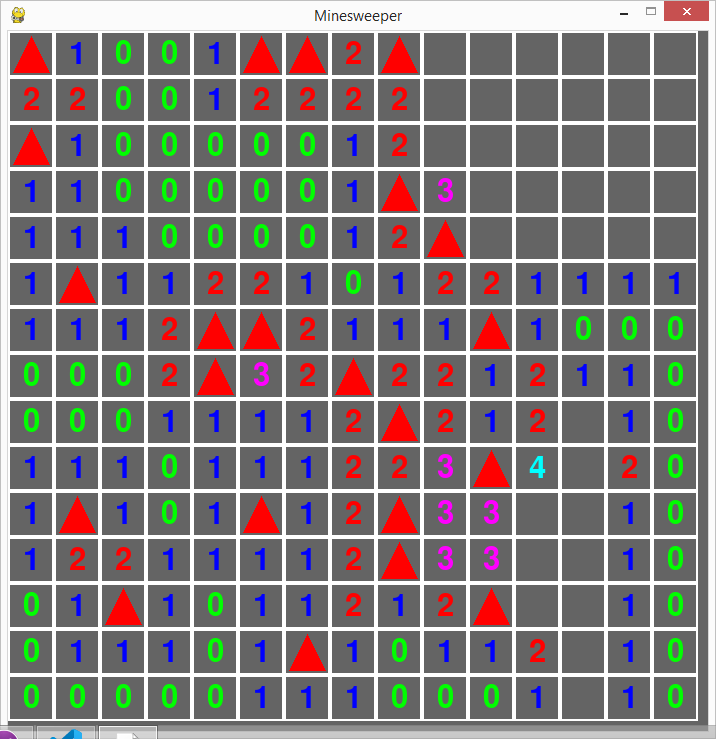

# Minesweeper
The classic game minesweeper where the player tries to uncover all squares that doesn't contain a mine. All 
squares that doesn't contain a mine shows a number of how many mines there are in the neighbouring squares.
If the user press square that neighbour no mines than it reveals all neighbouring squares. If any of them contains a zero they do the same.

It was made to practice coding using ChatGPT

 

All the code is written in Python and the graphics is generated using the pygame library